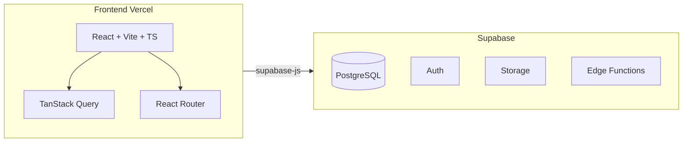

# Projekt-Index für KI & Erweiterungen

> **Suchst du eine „Index-Datei“ oder einen Einstieg für eine externe KI?** Dieses Dokument ist der **empfohlene Startpunkt**: Es fasst Zweck, Architektur, Konventionen und nächste Schritte zusammen. Details stehen in den verlinkten Dateien unter `docs/` und in `.cursor/rules/`.

Die folgenden Abschnitte helfen **externen Planern, Entwicklern und KI-Assistenten**, die Codebasis zu verstehen und **neue Module** (eigene Domänen, Routen, Tabellen) konsistent anzubinden – ohne die bestehenden Regeln zu brechen.

---

## 1. Einleitung und Zweck des Dokuments

**Für wen:** Personen oder Tools ohne tiefen Vorkenntnis-Stand, die Features planen, Code lesen oder implementieren sollen.

**Ziel:** Neue Funktionen auf **derselben Plattform** bauen: eine React-App, ein Supabase-Projekt, gemeinsame Auth und Rollen, ein Deployment. Integration über dieselben Muster (TanStack Query, RLS, Routing, `src/lib` + `src/hooks`).

**Beispiele für „neue Module“:** Eine zusätzliche Domäne neben Obst/Gemüse und Backshop (historisch im Dokument oft **Eventplanung** als Beispiel genannt), oder die geplante **Kassen**-Rolle (Spezifikation separat).

**Sicherheit:** Überblick zum aktuellen Stand der App: [SECURITY_REVIEW.md](SECURITY_REVIEW.md). Laufende Checklisten, einfach erklärtes Hintergrundwissen und Entscheidungsnotizen: [SECURITY_LIVING.md](SECURITY_LIVING.md). Tiefenreview älterer RLS-/Multi-Tenancy-Migrationen: [RLS_SECURITY_REVIEW_021_035.md](RLS_SECURITY_REVIEW_021_035.md).

---

## 2. Was ist dieses Projekt?

**PLU Planner** ist eine Web-App für wöchentliche **Preis-Look-Up (PLU) Listen** im Einzelhandel (Obst/Gemüse und **Backshop**). Die Zentrale liefert Excel-Dateien; ein Super-Admin lädt sie hoch, das System vergleicht mit der Vorwoche (neu / geändert / unverändert), Nutzer sehen personalisierte Listen (eigene Produkte, Ausblenden, Umbenennungen, Layout/Regeln, PDF-Export).

**Rollen:** Vier Stufen – `super_admin`, `admin`, `user`, `viewer`. Matrix und Flows: [ROLES_AND_PERMISSIONS.md](ROLES_AND_PERMISSIONS.md).

**Multi-Tenancy (Märkte):** Pro **Subdomain** (z. B. `markt.example.de`) wird der **aktuelle Markt** (`store_id`) über den **StoreContext** geladen; Daten in Hooks werden typischerweise mit `.eq('store_id', currentStoreId)` gefiltert und QueryKeys enthalten die Store-ID für Cache-Isolation. Sonderfall **Admin-Domain** (`admin.…`) für Super-Admin-Modus. Details: [ARCHITECTURE.md](ARCHITECTURE.md) (Abschnitt Multi-Tenancy).

**Zweite Produkt-Domäne:** **Backshop** – eigene Versionen, Upload, Layout, Regeln, Storage für Bilder; eigenes Routen- und Hook-Präfix (`backshop-*`). Gute **Blaupause** für eine weitere große Domäne.

**Geplant (Spezifikation):** **Kassen** – eigener Nutzertyp, PLU-Ansicht ohne Stammdaten-Edit, Meldungen aus der Kasse; siehe [FEATURE_KASSEN_SPEC.md](FEATURE_KASSEN_SPEC.md) und Kurzüberblick in [FEATURES.md](FEATURES.md).

**Responsive UI:** Fokus der App ist **Desktop**; ausgewählte Verwaltungsseiten (z. B. **Eigene Produkte** Obst/Backshop) haben unterhalb des Tailwind-Breakpoints **`md`** eine eigene, schmale Listenansicht, damit auf dem Handy keine horizontale Seiten-Scrollleiste nötig ist. Komponenten: `ObstCustomProductsList`, `BackshopCustomProductsList` in `src/components/plu/`.

---

## 3. Tech-Stack (verbindlich laut Projektregeln)

| Bereich | Technologie |
|--------|-------------|
| **Frontend** | React (aktuell v19), Vite, TypeScript (strict) |
| **UI** | Tailwind CSS v4, shadcn/ui |
| **State (Server)** | TanStack Query v5; **kein** Redux / Zustand / Jotai für Server-Daten |
| **Globale React-Contexts** | **Auth** (Session, Profil) und **Store** (aktueller Markt/Tenant). **Kein** weiterer globaler Context für fachliche Listen oder Server-Daten. |
| **Routing** | React Router (aktuell v7, `react-router-dom`) |
| **Backend** | Supabase (PostgreSQL, Auth, Storage, Edge Functions) |
| **Weitere** | Zod (Validierung), jsPDF (PDF), **exceljs** (Excel lesen/schreiben), sonner (Toasts), lucide-react (Icons), date-fns |

Referenzen: [README.md](../README.md), [ARCHITECTURE.md](ARCHITECTURE.md), [.cursor/rules/project-general.mdc](../.cursor/rules/project-general.mdc).

---

## 4. Architektur-Überblick

- **System:** Frontend auf **Vercel**, Anbindung nur an **Supabase** (kein eigener App-Server).
- **Datenfluss:** Server State über **TanStack Query** (`useQuery` / `useMutation`). Nach Schreiboperationen: `invalidateQueries` für betroffene Keys. **Kein** `useEffect`, nur um Server-Daten zu laden.
- **Auth:** **AuthContext** reagiert als einzige Stelle auf Supabase-Auth-Events (`onAuthStateChange`); Profil/Session werden für schnelle Reloads in **sessionStorage** gecacht (Details: [.cursor/rules/auth-architecture.mdc](../.cursor/rules/auth-architecture.mdc)).
- **Supabase-Client:** Nur aus [src/lib/supabase.ts](../src/lib/supabase.ts); Typen in [src/types/database.ts](../src/types/database.ts).
- **Provider-Reihenfolge** in [src/main.tsx](../src/main.tsx): `AuthProvider` → `StoreProvider` → `App`.



---

## 5. Projektstruktur und Konventionen („Wo gehört was hin?“)

| Ordner/Datei | Zweck |
|--------------|--------|
| **src/lib/** | Business-Logik, Helper, Konstanten. **Keine** UI. |
| **src/hooks/** | Pro Datendomäne Custom Hooks (TanStack Query); z. B. `useAuth`, `useBackshop*`. |
| **src/components/** | Wiederverwendbare UI: `ui/` = shadcn; `layout/` = Shell, Header, ProtectedRoute; domänenspezifisch z. B. `plu/`. |
| **src/pages/** | Eine Seite pro Route; **nur** Orchestrierung, **keine** Business-Logik. |
| **src/contexts/** | **AuthContext**, **StoreContext** (keine weiteren fachlichen Global-Contexts). |
| **src/types/** | TypeScript-Typen inkl. DB-Typen. |
| **Path-Alias** | `@/` → `src/`. |
| **Sprache** | UI-Texte und Code-Kommentare **Deutsch**; Bezeichner **Englisch**. |

Referenzen: [.cursor/rules/code-quality.mdc](../.cursor/rules/code-quality.mdc).

---

## 6. State Management und Datenmuster

- **Regel:** Fachliche Server-Daten nur über TanStack Query in Hooks, nicht in einem eigenen React Context.
- **Muster:** Neue Domäne → Hook(s) in `src/hooks/`, konsistente QueryKeys (z. B. `['plu-items', versionId, storeId]`, `['backshop-versions', storeId]`).
- **Query-Persistenz:** Nur Allowlist in [src/lib/query-persist-allowlist.ts](../src/lib/query-persist-allowlist.ts). Neue Listen, die nach Reload sofort da sein sollen → Präfix in `PERSIST_QUERY_KEY_PREFIXES`.
- **Prefetch:** [src/hooks/usePrefetchForNavigation.ts](../src/hooks/usePrefetchForNavigation.ts) und [src/components/AuthPrefetch.tsx](../src/components/AuthPrefetch.tsx).

Ausführlich: [RELOAD_UND_LAADEVERHALTEN.md](RELOAD_UND_LAADEVERHALTEN.md), [.cursor/rules/reload-performance.mdc](../.cursor/rules/reload-performance.mdc).

---

## 7. Auth und Rollen

- **Login:** E-Mail **oder** 7-stellige Personalnummer; Einmalpasswort (`must_change_password`), Route `/change-password`.
- **Routen:** `/user/*`, `/viewer/*`, `/admin/*`, `/super-admin/*`; geschützt mit **ProtectedRoute** (`requireAdmin`, `requireSuperAdmin` wo nötig).
- **RLS:** Rechte in PostgreSQL; Hilfsfunktionen `is_admin()`, `is_super_admin()`.
- **Profil:** Tabelle `profiles`; App liest Rolle und Flags aus dem AuthContext.

**Vorlage zweite Domäne:** Backshop-Hooks, -Seiten und -Routen (siehe Abschnitt 2).

---

## 8. Routing und Lazy Loading

- **Start:** [HomeRedirect](../src/components/HomeRedirect.tsx) – nicht eingeloggt → `/login`; sonst Dashboard je nach Rolle.
- **Routen:** [src/App.tsx](../src/App.tsx); öffentlich u. a. `/login`; geschützt mit `ProtectedRoute`.
- **Lazy Loading:** Seiten per `lazy(() => import('@/pages/...'))` mit gemeinsamem Lade-Fallback.
- **Dashboard-Chunks:** Vorladen über **AuthPrefetch** nach erfolgreicher Auth.

---

## 9. Datenbank (Supabase/PostgreSQL)

- **Schema:** `supabase/migrations/` (nummerierte SQL-Dateien).
- **Neue Domäne:** Neue Tabellen + Migration + **RLS** für alle Operationen; bestehende PLU-/Backshop-Tabellen nur bei bewusstem Bedarf anfassen.

Referenz: [DATABASE.md](DATABASE.md).

---

## 10. Design und UI

- **Design System:** shadcn-Variablen, PLU-Statusfarben fest (`.cursor/rules/design-system.mdc`).
- **Komponenten:** shadcn/ui als Basis; keine zusätzlichen UI-Frameworks.

---

## 11. Code-Qualität und Fehlerbehandlung

- **DRY:** Zuerst in `src/lib/` und `src/hooks/` suchen, dann erst neu bauen.
- **Fehler:** try/catch bei async; `toast.error` / `toast.success`; Supabase: `if (error) throw error`.
- **Build:** Nach Änderungen `npm run build` ohne Fehler; Features in `docs/` pflegen.

**Tests:** Vitest (`npm run test` / `npm run test:run`), Playwright E2E:

| Befehl | Bedeutung |
|--------|-----------|
| `npm run test:e2e` | Nur `@smoke` – schnell, für Alltag/CI |
| `npm run test:e2e:full` | Alle Tests; oft mit `.env.e2e` – vor Release |

Details: [TESTING.md](TESTING.md), [TEST_UND_RELEASE.md](TEST_UND_RELEASE.md), [.cursor/rules/e2e-tests.mdc](../.cursor/rules/e2e-tests.mdc).

---

## 12. Checkliste: neues Modul / neue Domäne

1. Typen in `src/types/` (oder Erweiterung `database.ts` + Migration).
2. Migration + RLS in Supabase.
3. Logik in `src/lib/`.
4. Hooks in `src/hooks/` mit stabilen QueryKeys (Store-ID einbeziehen, wenn marktabhängig).
5. Bei Bedarf: Persist-Allowlist, Prefetch, AuthPrefetch/Dashboard.
6. Komponenten unter sinnvollem Ordner (z. B. `src/components/meinmodul/`).
7. Seiten in `src/pages/` (dünn).
8. Routen in `src/App.tsx` + Lazy Import + passende `ProtectedRoute`-Flags.
9. Dokumentation: `FEATURES.md` / domänenspezifische Specs.

**Schnittstellen:** Gleiche Auth, gleiche Rollen (oder erweiterte Rollen nur nach DB-/Spec-Änderung), ein Deployment.

---

## 13. Deployment und Umgebung

- **Hosting:** Vercel; SPA-Fallback über `vercel.json`.
- **Env:** `VITE_SUPABASE_URL`, `VITE_SUPABASE_ANON_KEY` (lokal z. B. `.env.local`).
- **Edge Functions** (Stand Repo): `create-user`, `reset-password`, `delete-user`, `update-user-role`, `update-user-store-access` – Deploy über Supabase CLI, Aufruf z. B. `supabase.functions.invoke(...)`.
- **Storage:** u. a. Backshop-Bilder; neue Buckets analog mit RLS planen.

---

## 14. Bestehende Dokumentation (Referenzen)

| Dokument | Inhalt |
|----------|--------|
| [ARCHITECTURE.md](ARCHITECTURE.md) | Datenfluss, Multi-Tenancy, Hooks, Module |
| [ROLES_AND_PERMISSIONS.md](ROLES_AND_PERMISSIONS.md) | Rollen, Login, RLS, Passwort |
| [DATABASE.md](DATABASE.md) | Tabellen, Funktionen, Migrations |
| [FEATURES.md](FEATURES.md) | Implementierungsstand, Business-Regeln |
| [FEATURE_KASSEN_SPEC.md](FEATURE_KASSEN_SPEC.md) | Geplantes Kassen-Feature (für spätere Umsetzung) |
| [RELOAD_UND_LAADEVERHALTEN.md](RELOAD_UND_LAADEVERHALTEN.md) | Performance, Cache, Prefetch |
| [TESTING.md](TESTING.md) / [TEST_UND_RELEASE.md](TEST_UND_RELEASE.md) | Tests und Release-Checklisten |
| [.cursor/rules/](../.cursor/rules/) | Auth, Code-Qualität, Design, E2E, Safe Changes |

**Externe Master-Spec (falls vorhanden):** Der Projektinhaber pflegt teils eine gesammelte Spezifikation außerhalb des Repos (z. B. `MASTER_SPEC_PLU_PLANNER.md`); der **in-Repo-Stand** für Schema und Features ist maßgeblich über `docs/` + `supabase/migrations/`.

---

## 15. Beispiel „neues Modul“: Anforderungen an die Integration

Gilt analog für jede größere Erweiterung (Events, Kassen nach Spec, weitere Listen, …):

| Anforderung | Bedeutung |
|-------------|-----------|
| **Gleicher Auth-Flow** | Kein zweiter Login; `useAuth()` / Profil für Berechtigungen. |
| **Rollen klären** | Wer darf lesen/schreiben? Entweder bestehende vier Rollen oder dokumentierte Erweiterung (DB + RLS). |
| **Kein fachlicher Global-Context** | Daten über TanStack Query in Hooks. |
| **Routing** | Routen unter passendem Präfix pro Rolle; `ProtectedRoute` wie bei bestehenden Seiten. |
| **UI-Konsistenz** | shadcn + Tailwind, `DashboardLayout` wo passend. |
| **Eine Codebasis** | Neue Dateien unter `src/…`; Migrationen unter `supabase/migrations/`. |

**Illustration Routen (fiktiv, z. B. Event-Modul):**

| Rolle | Beispiel-Routen |
|-------|------------------|
| viewer | `/viewer/events` (nur Lesen, falls vorgesehen) |
| user | `/user/events`, `/user/events/:id` |
| admin | `/admin/events`, … |
| super_admin | `/super-admin/events`, … |

Für **Kassen** konkrete URLs und Datenmodell aus [FEATURE_KASSEN_SPEC.md](FEATURE_KASSEN_SPEC.md) übernehmen, sobald umgesetzt wird.

---

## 16. Konkrete Muster und Referenz-Dateien

| Bedarf | Referenz im Repo |
|--------|-------------------|
| Hook: Query + Mutation + `invalidateQueries` | [src/hooks/useCustomProducts.ts](../src/hooks/useCustomProducts.ts) |
| Seite: Dashboard mit Karten | [src/pages/UserDashboard.tsx](../src/pages/UserDashboard.tsx) |
| Seite: komplexe Liste | [src/pages/MasterList.tsx](../src/pages/MasterList.tsx), [src/pages/BackshopMasterList.tsx](../src/pages/BackshopMasterList.tsx) |
| Zweite Domäne end-to-end | Backshop: `useBackshop*`, `BackshopMasterList`, Routen `…/backshop-…` |

**Kurzes Hook-Muster:**

```ts
// Lesen
useQuery({
  queryKey: ['my-entity', storeId],
  queryFn: async () => {
    const { data, error } = await supabase.from('my_entity').select('*').eq('store_id', storeId);
    if (error) throw error;
    return data;
  },
});
// Schreiben
useMutation({
  mutationFn: async (payload) => { /* insert/update */ },
  onSuccess: () => {
    queryClient.invalidateQueries({ queryKey: ['my-entity', storeId] });
    toast.success('Gespeichert');
  },
});
```

Seiten: keine direkten `supabase.from()`-Aufrufe – Logik in Hooks/`lib`.

---

## 17. Do's und Don'ts

**Do:** TanStack Query; nach Mutationen invalidieren; RLS für neue Tabellen; Routen in `App.tsx`; Supabase nur aus `src/lib/supabase.ts`; Store-ID in Keys/Filtern bei Markt-Daten.

**Don't:** Server-Daten per `useEffect` laden; Redux/Zustand für Server-State; zusätzliche UI-Bibliotheken; zweiter Auth-Listener neben AuthContext.

**Fallstricke:** Route vergessen; RLS vergessen; Persist-Allowlist bei „sofort nach Reload sichtbar“ vergessen; Markt-Isolation bei Multi-Tenancy vergessen.

---

## 18. Kurz-Glossar

| Begriff | Bedeutung |
|---------|-----------|
| **PLU** | Preis-Look-Up / Artikelkennung in den Listen |
| **KW** | Kalenderwoche (Versionen, Upload, Wechsel) |
| **RLS** | Row Level Security in PostgreSQL |
| **Store** | Markt/Filiale; `store_id` + Subdomain-Zuordnung |
| **Persist-Allowlist** | QueryKey-Präfixe für sessionStorage-Persistenz |
| **ProtectedRoute** | Auth- und Rollen-Guard |
| **DashboardLayout** | Gemeinsames Layout für eingeloggte Bereiche |

---

*Zuletzt als Gesamtbild für KI & Erweiterungen überarbeitet: Architektur (Auth + Store, Multi-Tenancy), aktueller Stack, E2E-Befehle, Backshop als Vorlage, Kassen-Spec verlinkt.*
