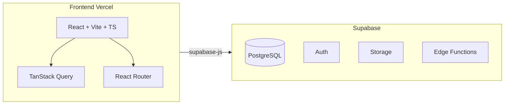

# Projekt-Übersicht für Erweiterung (z. B. Eventplanungs-App)

Diese Datei bündelt alles Wichtige über das bestehende Projekt, damit ein **externer Planer** oder ein **anderer KI-Assistent** darauf aufbauend ein neues Modul (z. B. eine Eventplanungs-App) planen und nahtlos in dieselbe Codebasis und Infrastruktur integrieren kann.

---

## 1. Einleitung und Zweck des Dokuments

**Für wen:** Externe Kollegen, KI-Assistenten oder Planer, die das Projekt nicht im Detail kennen und ein **neues Feature oder eine neue App** (z. B. Eventplanung) darauf aufsetzen sollen.

**Ziel:** Die Eventplanungs-App (oder ein anderes neues Modul) soll auf **demselben System** gebaut werden – gleiche Codebasis, gleiche Auth, gleiche Rollen, ein gemeinsames Deployment. So kann die Integration später über gemeinsame Schnittstellen (Login, Navigation, Rollen) nahtlos erfolgen, ohne zwei getrennte Systeme zu betreiben.

---

## 2. Was ist dieses Projekt?

**PLU Planner** ist eine Web-App zur Verwaltung wöchentlicher **Preis-Look-Up (PLU) Listen** für Obst/Gemüse und Backshop im Einzelhandel. Zentrale liefert Excel-Dateien; ein Super-Admin lädt sie hoch, das System vergleicht automatisch mit der Vorwoche (neu/geändert/unverändert), und alle Nutzer sehen personalisierte Listen (eigene Produkte, ausgeblendete, Umbenennungen, PDF-Export). Es gibt vier Rollen (Super-Admin, Admin, User, Viewer) und ein durchgängiges Konzept aus Auth, TanStack Query, Supabase und klaren Ordner-/Code-Konventionen.

**Für die Erweiterung** ist entscheidend: Dieselbe **Architektur und Konventionen** (State, Hooks, Lib, Seiten, Routing, Reload-Verhalten) sollen für die Eventplanung wiederverwendet werden, damit die neue Funktionalität sich wie ein natürlicher Teil der App verhält.

---

## 3. Tech-Stack (verbindlich, nicht abweichen)

| Bereich | Technologie |
|--------|-------------|
| **Frontend** | React 18, Vite, TypeScript (strict) |
| **UI** | Tailwind CSS v4, shadcn/ui (alle UI-Komponenten) |
| **State** | TanStack Query v5 für alle Server-Daten; **kein** Redux/Zustand/Jotai; einziger globaler Context: Auth (`AuthProvider`) |
| **Routing** | React Router v6 |
| **Backend** | Supabase (PostgreSQL, Auth, Storage, Edge Functions) |
| **Weitere** | Zod (Validierung), jsPDF (PDF), xlsx/ExcelJS (Excel), sonner (Toasts), lucide-react (Icons), date-fns |

Referenzen: [README.md](../README.md), [ARCHITECTURE.md](ARCHITECTURE.md).

---

## 4. Architektur-Überblick

- **System:** Frontend wird auf **Vercel** gehostet und spricht ausschließlich mit **Supabase** (PostgreSQL, Auth, Storage, Edge Functions). Es gibt **keinen eigenen Backend-Server**.
- **Datenfluss:** Server State ausschließlich über **TanStack Query** (useQuery/useMutation). Nach einer Mutation: `invalidateQueries` für betroffene Keys → automatischer Refetch. **Kein** `useEffect` zum Laden von Server-Daten.
- **Auth:** Ein zentraler **AuthProvider** ([src/contexts/AuthContext.tsx](../src/contexts/AuthContext.tsx)) hält User, Session und Profil; Profil/Session werden in sessionStorage gecacht, damit Reloads schnell wirken. Supabase Client wird **nur** über [src/lib/supabase.ts](../src/lib/supabase.ts) importiert und ist mit dem typisierten `Database` aus [src/types/database.ts](../src/types/database.ts) versehen.



---

## 5. Projektstruktur und Konventionen („Wo gehört was hin?“)

| Ordner/Datei | Zweck |
|--------------|--------|
| **src/lib/** | Business-Logik, Helper, Konstanten, Supabase-Client. **Keine** UI. |
| **src/hooks/** | Pro Datendomäne ein Custom Hook (TanStack Query Wrapper); z. B. useAuth. |
| **src/components/** | Wiederverwendbare UI: `ui/` = shadcn; `layout/` = Shell, Header, ProtectedRoute; domänenspezifisch z. B. `plu/`, später z. B. `events/`. |
| **src/pages/** | Seiten = eine pro Route; **nur** Orchestrierung, **keine** Business-Logik. |
| **src/types/** | TypeScript-Interfaces/Types (inkl. von Supabase generierte DB-Typen). |
| **Path-Alias** | `@/` zeigt auf `src/`. |
| **Sprache** | UI-Texte und Code-Kommentare auf **Deutsch**; Variablen- und Funktionsnamen auf **Englisch**. |

Referenzen: [.cursor/rules/project-general.mdc](../.cursor/rules/project-general.mdc), [.cursor/rules/code-quality.mdc](../.cursor/rules/code-quality.mdc).

---

## 6. State Management und Datenmuster

- **Regel:** Kein globaler React Context für fachliche Daten; **Ausnahme:** Auth (AuthProvider).
- **Muster:** Neue Domäne = neuer Hook in `src/hooks/` (useQuery/useMutation), Lesen/Schreiben über Supabase; bei Schreiben: `invalidateQueries` für die betroffenen QueryKeys. QueryKeys sind konsistent aufgebaut, z. B. `['plu-items', versionId]`, `['custom-products']`, `['backshop-versions']` – für Events z. B. `['events']`, `['events', eventId]`.
- **Query-Persistenz:** Nur ausgewählte QueryKeys werden in **sessionStorage** persistiert. Die Allowlist steht in [src/lib/query-persist-allowlist.ts](../src/lib/query-persist-allowlist.ts). Neue Listen/Queries, die nach Reload sofort sichtbar sein sollen → Key-Präfix in `PERSIST_QUERY_KEY_PREFIXES` eintragen.
- **Prefetch:** Zentrale Prefetch-Logik in [src/hooks/usePrefetchForNavigation.ts](../src/hooks/usePrefetchForNavigation.ts). Bei neuen Hauptrouten/Dashboards Prefetch dort ergänzen und in [AuthPrefetch](../src/components/AuthPrefetch.tsx) oder auf dem zugehörigen Dashboard auslösen.

Ausführlich: [RELOAD_UND_LAADEVERHALTEN.md](RELOAD_UND_LAADEVERHALTEN.md), [.cursor/rules/reload-performance.mdc](../.cursor/rules/reload-performance.mdc).

---

## 7. Auth und Rollen

- **Vier Rollen:** `super_admin`, `admin`, `user`, `viewer`. Details und Rechte-Matrix: [ROLES_AND_PERMISSIONS.md](ROLES_AND_PERMISSIONS.md).
- **Login:** E-Mail **oder** 7-stellige Personalnummer; Einmalpasswort-Flow (`must_change_password`), Passwort-Änderung unter `/change-password`.
- **Routen nach Rolle:** `/user/*`, `/viewer/*`, `/admin/*`, `/super-admin/*`; geschützt über **ProtectedRoute** mit optional `requireAdmin` (Admin + Super-Admin).
- **RLS:** Datenbank-Rechte über PostgreSQL Row Level Security; Hilfsfunktionen `is_admin()`, `is_super_admin()` in der DB.
- **Profil:** Tabelle `profiles` (id, email, personalnummer, display_name, role, must_change_password, …); Auth-State und Profil kommen aus dem AuthContext.

**Für Eventplanung:** Die gleichen `profiles` und Rollen können genutzt werden; falls nötig, sollte klar dokumentiert werden, ob neue Rollen oder zusätzliche Claims erforderlich sind.

**Vorlage in der App:** Die App enthält bereits eine zweite Domäne **Backshop** (eigene PLU-Liste mit Versionen, Upload, Layout, Regeln, getrennte Tabellen). Das Muster – eigene Hooks (`useBackshop*`), eigene Seiten (`BackshopMasterList`, `BackshopUploadPage`, …), eigene Routen (`/user/backshop-list`, `/super-admin/backshop-upload`, …), eigene QueryKeys (`backshop-*`) – ist eine gute Vorlage für ein drittes Modul (Eventplanung).

---

## 8. Routing und Lazy Loading

- **Startseite:** Route `/` wird von [HomeRedirect](../src/components/HomeRedirect.tsx) behandelt: nicht eingeloggt → `/login`; eingeloggt je nach Rolle → `/super-admin`, `/admin`, `/viewer` oder `/user` (jeweils Dashboard).
- **Routen:** Zentral in [src/App.tsx](../src/App.tsx). Öffentlich: `/login`; geschützt: `ProtectedRoute` mit optional `requireAdmin` bzw. `requireSuperAdmin`. Bei fehlender Berechtigung: Redirect zum passenden Dashboard (z. B. Viewer auf Admin-Route → `/viewer`).
- **ProtectedRoute** ([src/components/layout/ProtectedRoute.tsx](../src/components/layout/ProtectedRoute.tsx)): Nicht eingeloggt → `/login`; `must_change_password` → `/change-password`; Admin-Route ohne Admin-Rolle → `/user`; Super-Admin-Route ohne Super-Admin → `/admin` oder `/user`.
- **Lazy Loading:** Seiten werden per `lazy(() => import('@/pages/...'))` geladen; einheitlicher **PageLoadingFallback** (Header + Spinner).
- **Dashboard-Chunk:** Nach Auth wird der passende Dashboard-Chunk vorab geladen (AuthPrefetch), damit nach Reload beim ersten Aufruf kein spürbarer Chunk-Download entsteht.

**Für neue Eventplanungs-Seiten:** Gleiches Muster – lazy Import, Route unter passendem Präfix (z. B. `/user/events/...`, `/admin/events/...`).

---

## 9. Datenbank (Supabase/PostgreSQL)

- **Schema:** Migrations unter `supabase/migrations/` (nummeriert: 001_, 002_, …). Der aktuelle Stand ergibt sich aus der Reihenfolge der ausgeführten Migrations.
- **Wichtige Konzepte:** RLS für alle Tabellen; DB-Helfer wie `get_active_version()`, `lookup_email_by_personalnummer`; Trigger z. B. für automatisches Anlegen eines Profils bei neuem Auth-User.
- **Für Erweiterung:** Neue Domäne = neue Tabellen + neue Migration; RLS an `profiles.role` bzw. `is_admin()`/`is_super_admin()` anbinden. Bestehende PLU-Tabellen müssen **nicht** geändert werden (außer gewollt).

Referenz: [DATABASE.md](DATABASE.md).

---

## 10. Design und UI

- **Design System:** Primärfarben über shadcn CSS Variables; Hintergrund `bg-background`; Karten `bg-card`, `shadow-sm`, `rounded-lg`. Dark Mode ist nicht vorgeschrieben.
- **Tabellen/Layout:** Konsistente Abstände (p-4, gap-4); Dialoge mit sinnvollen max-w (max-w-lg, max-w-xl, …); lange Texte mit `break-words` oder ScrollArea statt hartem `truncate`.
- **Komponenten:** Ausschließlich shadcn/ui als Basis; keine weiteren ad-hoc UI-Bibliotheken.

Referenz: [.cursor/rules/design-system.mdc](../.cursor/rules/design-system.mdc).

---

## 11. Code-Qualität und Fehlerbehandlung

- **DRY:** Vor neuer Logik prüfen, ob in `src/lib/` oder `src/hooks/` bereits etwas Ähnliches existiert; bei Wiederholung auslagern.
- **Fehler:** try/catch bei async; Fehler mit `toast.error()`, Erfolg mit `toast.success()`; bei Supabase: `if (error) throw error`.
- **Build:** Nach Änderungen muss `npm run build` durchlaufen; neue Features in `docs/` dokumentieren.

**Tests:** Unit-Tests mit **Vitest** (z. B. `src/lib/*.test.ts`), E2E mit **Playwright** (`tests/` bzw. Projekt-Root). Befehle: `npm run test` / `npm run test:run`, `npm run test:e2e`. Details: [TESTING.md](TESTING.md).

---

## 12. Wie man die App um ein neues Modul (z. B. Eventplanung) erweitert

**Checkliste:**

1. **Types:** Neue oder erweiterte Typen in `src/types/`.
2. **Datenbank:** Neue Tabellen, Migration, RLS.
3. **src/lib/:** Reine Logik/Helper für die neue Domäne.
4. **src/hooks/:** Ein Hook pro Domäne (Query/Mutation), QueryKeys konsistent (z. B. `['events', ...]`).
5. **Persist-Allowlist:** Neue Query-Key-Präfixe in [src/lib/query-persist-allowlist.ts](../src/lib/query-persist-allowlist.ts), falls Listen nach Reload sofort sichtbar sein sollen.
6. **Prefetch:** In [src/hooks/usePrefetchForNavigation.ts](../src/hooks/usePrefetchForNavigation.ts) (oder eigenes Prefetch-Modul) ergänzen und in AuthPrefetch/Dashboard aufrufen.
7. **src/components/:** Wiederverwendbare UI (z. B. Unterordner `events/`).
8. **src/pages/:** Neue Seiten nur orchestrierend.
9. **Routen** in [src/App.tsx](../src/App.tsx) unter passendem Präfix; `ProtectedRoute`/`requireAdmin` je nach gewünschter Rolle.
10. **Lazy Imports** für neue Seiten; optional Dashboard-Chunk-Vorladung für ein Event-Dashboard.

**Schnittstellen für spätere Verbindung:** Gemeinsame Auth (gleicher AuthProvider, gleiche `profiles`), gleiche Rollen, ein gemeinsames Deployment (eine Vercel-App, eine Supabase-Instanz). Eventplanungs-Features können unter eigenen Routen (z. B. `/user/events`, `/admin/events`) leben und dieselbe Header/Navigation nutzen.

---

## 13. Deployment und Umgebung

- **Hosting:** Vercel; SPA-Routing (alle Pfade → index.html) über `vercel.json`.
- **Umgebung:** `VITE_SUPABASE_URL`, `VITE_SUPABASE_ANON_KEY` (lokal in `.env.local`, auf Vercel in den Projekt-Settings).
- **Lokal starten:** `npm install`, dann `npm run dev` (Dev-Server z. B. http://localhost:5173). Vorher Supabase-Projekt anlegen und Migrations ausführen (siehe [README.md](../README.md)).
- **Edge Functions:** Werden über Supabase CLI deployt (create-user, reset-password, delete-user, update-user-role); Aufruf im Frontend per `supabase.functions.invoke('create-user', { body: { … } })`. Für Eventplanung können bei Bedarf eigene Edge Functions ergänzt werden.
- **Supabase Storage:** Wird bereits für Backshop-Produktbilder genutzt (Bucket, RLS-Policies). Falls Events Anhänge oder Bilder brauchen, gleiches Muster (eigener Bucket, Policies, Helper in `src/lib/`).

---

## 14. Bestehende Dokumentation (Referenzen)

Zum Vertiefen:

| Dokument | Inhalt |
|----------|--------|
| [ARCHITECTURE.md](ARCHITECTURE.md) | Datenfluss, Hooks, Lib-Module, Seiten, State Management |
| [ROLES_AND_PERMISSIONS.md](ROLES_AND_PERMISSIONS.md) | Rollen, Login-Flows, RLS, Passwort-Management |
| [DATABASE.md](DATABASE.md) | Schema, Tabellen, RLS, SQL-Funktionen, Migrations |
| [FEATURES.md](FEATURES.md) | Features und Business-Regeln (PLU/Backshop) |
| [RELOAD_UND_LAADEVERHALTEN.md](RELOAD_UND_LAADEVERHALTEN.md) | Reload/Performance, Auth-Cache, Prefetch, Persist-Allowlist |
| [TESTING.md](TESTING.md) | Unit-Tests (Vitest), E2E (Playwright) |
| [.cursor/rules/](../.cursor/rules/) | Code-Qualität, Design, Reload-Performance, Projekt-Allgemein |

---

## 15. Eventplanung: Anforderungen an die Integration

Damit die Eventplanungs-Funktion **nahtlos** in die bestehende App passt, muss Folgendes gelten:

| Anforderung | Bedeutung |
|-------------|-----------|
| **Gleicher Auth** | Kein eigener Login. Nutzer melden sich wie bisher an; `useAuth()` und `profile` liefern Rolle und User-Infos auch für Event-Seiten. |
| **Gleiche Rollen** | Es werden dieselben vier Rollen genutzt. Wer darf was bei Events entscheiden (z. B. nur Admin/Super-Admin Events anlegen) muss definiert werden, aber keine neuen Rollen-Typen in der DB. |
| **Kein neuer globaler State** | Kein eigener React Context für Event-Daten. Alles über TanStack Query (eigene Hooks mit QueryKeys `events`, `events-detail` o. ä.). |
| **Gleiches Routing-Muster** | Event-Routen unter `/user/events`, `/admin/events`, `/super-admin/events` (oder `/viewer/events`); jede Route mit `ProtectedRoute` bzw. `requireAdmin` wie bei PLU/Backshop. |
| **Gleiche UI-Basis** | shadcn/ui + Tailwind; neue Seiten in `DashboardLayout`; gleiche Abstände, Karten, Buttons wie im Rest der App. |
| **Eine Codebase, ein Deploy** | Kein separates Repo für Events. Neue Dateien in `src/pages/`, `src/hooks/`, `src/components/events/`, `src/lib/`; neue Migration in `supabase/migrations/`. |
| **Header/Navigation** | App-Header bleibt einer; Event-Links (z. B. „Events“) in die bestehende Navigation (z. B. im Dashboard oder im Header) integrieren. |

**Routen-Matrix (Beispiel für Eventplanung):**

| Rolle        | Dashboard-Route   | Beispiel Event-Routen                          |
|-------------|-------------------|-------------------------------------------------|
| viewer      | `/viewer`         | `/viewer/events` (nur Lesen, falls gewünscht)   |
| user        | `/user`           | `/user/events`, `/user/events/:id`              |
| admin       | `/admin`          | `/admin/events`, `/admin/events/:id`            |
| super_admin | `/super-admin`    | `/super-admin/events`, `/super-admin/events/...` |

---

## 16. Konkrete Muster und Referenz-Dateien

Für den Anschluss der Eventplanung können folgende Dateien als **Vorlage** dienen:

| Was braucht man | Referenz im Projekt |
|-----------------|---------------------|
| **Hook: Liste laden + Mutation + Invalidierung** | [src/hooks/useCustomProducts.ts](../src/hooks/useCustomProducts.ts) – useQuery mit `queryKey: ['custom-products']`, useMutation mit `onSuccess` → `invalidateQueries` + `toast.success`. |
| **Hook: CRUD mit Auth (user.id)** | Ebenfalls useCustomProducts: `useAuth()`, `user.id` für `created_by`; Insert über `supabase.from('...').insert().select().single()`. |
| **Seite: Dashboard mit Karten** | [src/pages/UserDashboard.tsx](../src/pages/UserDashboard.tsx) – `DashboardLayout`, `useNavigate`, Karten mit `onClick` → `navigate('/user/...')`. So kann z. B. eine Karte „Events“ ergänzt werden. |
| **Seite: Liste mit Daten aus Hook** | [src/pages/MasterList.tsx](../src/pages/MasterList.tsx) oder [src/pages/BackshopMasterList.tsx](../src/pages/BackshopMasterList.tsx) – viele useXxx-Hooks, Aufruf von `buildDisplayList` bzw. Darstellung; Seite orchestriert nur, keine DB-Logik in der Seite. |
| **Ganze zweite Domäne (Backshop)** | Backshop: eigene Versionen, Upload, Layout, Regeln. Hooks: `useBackshopVersions`, `useBackshopPLUData`, …; Seiten: `BackshopMasterList`, `BackshopUploadPage`, …; Routen: `/user/backshop-list`, `/super-admin/backshop-upload`, ….

**Typisches Hook-Muster (verkürzt):**

```ts
// Lesen
useQuery({ queryKey: ['events'], queryFn: async () => { const { data, error } = await supabase.from('events').select('*'); if (error) throw error; return data; } })
// Schreiben
useMutation({ mutationFn: async (payload) => { ... supabase.from('events').insert(payload) ... }, onSuccess: () => { queryClient.invalidateQueries({ queryKey: ['events'] }); toast.success('...'); } })
```

**Typisches Seiten-Muster:** Seite nutzt `DashboardLayout`, ruft `useAuth()` und domänenspezifische Hooks (`useEvents()`, …), rendert shadcn-Komponenten und ggf. eigene `components/events/...`. Keine direkten `supabase.from()`-Aufrufe in der Seite.

---

## 17. Do's und Don'ts / Häufige Fallstricke

**Do's:**

- Immer **TanStack Query** für Server-Daten (useQuery/useMutation); nach Mutation `invalidateQueries` + ggf. `toast.success`/`toast.error`.
- **Neue Tabellen** → eigene Migration (nummeriert), inkl. **RLS-Policies** für alle neuen Tabellen.
- **Neue Routen** in [src/App.tsx](../src/App.tsx) eintragen (lazy Import + Route mit ProtectedRoute).
- **Dashboard-Karten** oder Nav-Links für Events auf allen relevanten Dashboards (User, Admin, Super-Admin) ergänzen.
- Listen, die nach Reload sofort da sein sollen → **Persist-Allowlist** in [src/lib/query-persist-allowlist.ts](../src/lib/query-persist-allowlist.ts) ergänzen.
- **Supabase Client** nur aus [src/lib/supabase.ts](../src/lib/supabase.ts) importieren; **Typen** aus [src/types/database.ts](../src/types/database.ts) nutzen/erweitern.

**Don'ts:**

- **Kein** `useEffect` zum Laden von Server-Daten; immer useQuery.
- **Kein** neuer globaler React Context für fachliche Daten (nur Auth ist erlaubt).
- **Keine** Redux/Zustand/Jotai für Server-State.
- **Keine** neuen UI-Bibliotheken; nur shadcn/ui + Tailwind.

**Häufige Fallstricke:**

| Fallstrick | Folge | Abhilfe |
|------------|--------|---------|
| Route vergessen in App.tsx | Event-Seite ist nicht erreichbar. | Jede neue Seite in App.tsx als lazy Route unter dem richtigen Präfix eintragen. |
| RLS auf neuen Tabellen vergessen | Unbefugte können lesen/schreiben. | In der Migration für jede neue Tabelle SELECT/INSERT/UPDATE/DELETE Policies definieren (z. B. über `auth.uid()` oder `is_admin()`). |
| Persist-Allowlist nicht ergänzt | Nach Reload fehlen Event-Listen kurz oder länger. | Key-Präfix `events` (o. ä.) in `PERSIST_QUERY_KEY_PREFIXES` aufnehmen. |
| useEffect für Daten | Race Conditions, doppelte Requests, schwer wartbar. | Stattdessen useQuery verwenden. |
| Eigener Context für Event-State | Widerspricht Architektur; später schwer integrierbar. | Alles in Hooks mit TanStack Query halten. |

---

## 18. Kurz-Glossar (für das Lesen der Codebase)

| Begriff | Bedeutung |
|---------|-----------|
| **PLU** | Preis-Look-Up – Artikelnummer (z. B. 5-stellig) für die PLU-Listen (Obst/Gemüse, Backshop). |
| **KW** | Kalenderwoche. Viele PLU-Features sind pro KW (Version, Upload, Wechsel am Samstag). |
| **RLS** | Row Level Security – PostgreSQL-Feature; Zugriff auf Zeilen nur nach Policy (z. B. nur eigene oder nur für Admins). |
| **AuthProvider** | Einziger globaler React Context; hält user, session, profile, isAdmin, isSuperAdmin, isViewer, mustChangePassword. |
| **Persist-Allowlist** | Liste von QueryKey-Präfixen; nur diese Queries werden im sessionStorage zwischen Reloads gespeichert. |
| **ProtectedRoute** | Wrapper-Komponente; prüft Auth und Rolle, leitet sonst auf Login oder passendes Dashboard um. |
| **DashboardLayout** | Layout-Wrapper für alle Dashboard-Seiten (Header, Hauptbereich); wird von jeder Dashboard-Seite genutzt. |

Mit dieser Übersicht (Abschnitte 1–18) und den Referenzen in Abschnitt 14 kann ein externer Planer oder KI-Assistent verstehen, was das Projekt ist, wie es aufgebaut ist und wie eine Eventplanungs-App darauf aufgesetzt und angebunden werden kann. Die Abschnitte **15–18** sind gezielt auf die Vorarbeit für die Eventplanung zugeschnitten.
