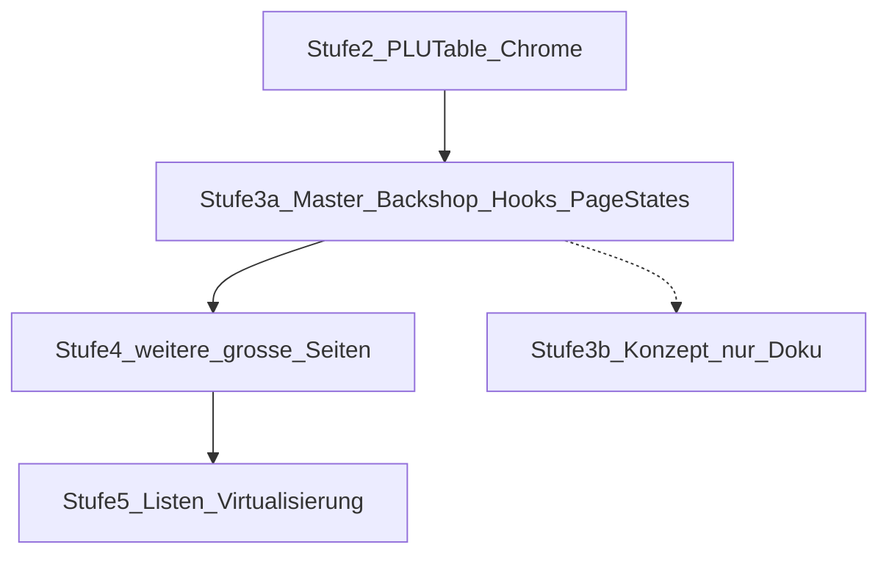

# Refactor-Roadmap: Stufen (überblick)

Historisch gab es **keine offiziellen „Stufe 4/5“** im ersten Stufe‑3‑Plan; dort nur **Stufe 2**, dann **Stufe 3** mit **3a** (Struktur) und **3b** (Virtualisierung). Dieses Dokument **reiht die nächsten Schritte ein**, damit Nummerierung und Priorität klar sind.

## Überblick



| Stufe | Kurzbeschreibung | Status |
|-------|------------------|--------|
| **2** | PLUTable splitten, Master-/Backshop-Header & Toolbar, gemeinsame Hooks, Agenten-Leitplanken | erledigt |
| **3a** | Master-/Backshop-Masterlisten: Display-/PDF-Hooks, `*PageStates.tsx`, Werbungs-UI-Hook Backshop | erledigt |
| **3b** | Virtualisierung nur als **Konzept** (Risiken Find-in-Page, Kiosk, E2E) | Doku: [VIRTUALISIERUNG_SPIKE.md](VIRTUALISIERUNG_SPIKE.md) |
| **4** | **App-weiter** dasselbe Strukturmuster auf übrige große `src/pages/` anwenden (Prioritäten + Slices siehe unten) | **Plan abgeschlossen:** **4.1–4.4** erledigt (inkl. Backshop Ausgeblendet: Utils + `useBackshopHiddenProductsPageModel` + UI-Slices); **4.5–4.10** mit Plan-Minimum erledigt (Hooks/Lib wie tabelliert). Weitere Verdünnung einzelner Pages **optional** – Details [REFACTOR_STUFE_4_AGENT_PLAN.md](REFACTOR_STUFE_4_AGENT_PLAN.md) |
| **5** | **Virtualisierung** der PLU-Hauptlisten umsetzen | **Nur nach M0:** [STUFE_5_M0_CHECKLIST.md](STUFE_5_M0_CHECKLIST.md); dann [REFACTOR_STUFE_5_AGENT_PLAN.md](REFACTOR_STUFE_5_AGENT_PLAN.md); Konzept: [VIRTUALISIERUNG_SPIKE.md](VIRTUALISIERUNG_SPIKE.md) |

### Status: wie lesen?

- Die **Zeile zu Stufe 4** in der Tabelle ist ein **Kurzüberblick** (was grob erledigt ist und was noch inkrementell möglich ist).
- **Stufe 4 (Plan-Ziele):** Stand ist mit [REFACTOR_STUFE_4_AGENT_PLAN.md](REFACTOR_STUFE_4_AGENT_PLAN.md) abgestimmt – die dortigen Arbeitspakete gelten als **umgesetzt** (Minimum bei 4.5–4.10); **Stufe 5** ist **keine** Pflicht-Fortsetzung von Stufe 4.
- **Details**: welches Arbeitspaket (4.1–4.10) was bedeutet, aktuelle Auslagerungen und der Unterschied **Slice erledigt** vs. **Page weiter verdünnen** → immer [REFACTOR_STUFE_4_AGENT_PLAN.md](REFACTOR_STUFE_4_AGENT_PLAN.md).

### Sync-Regel (keine Doku-Drift)

Wer den **Umsetzungsstand** oder die **Tabelle 4.5–4.10** in `REFACTOR_STUFE_4_AGENT_PLAN.md` ändert, passt in **derselben** Änderung die **Stufe‑4‑Statuszeile** in der Tabelle oben an. Umgekehrt: Änderungen nur an der Roadmap-Tabelle müssen mit dem Agent-Plan übereinstimmen.

Leitplanken für Agents: [.cursor/rules/refactor-roadmap-agents.mdc](../.cursor/rules/refactor-roadmap-agents.mdc).

## Stufe 3 – Planungs- und Umsetzungsstand

| Teil | Planinhalt | Umsetzung |
|------|------------|-----------|
| **3a** | Master-/Backshop-Masterlisten verdünnen (Hooks, PageStates, keine Layout-Engine-Änderung) | **Erledigt** |
| **3b** | Listen-Virtualisierung | **Nicht** Teil von 3a; nur **Konzept** → [VIRTUALISIERUNG_SPIKE.md](VIRTUALISIERUNG_SPIKE.md). Umsetzung = **Stufe 5**. |

**Fazit:** Stufe 3 ist **planerisch abgeschlossen**, sobald die Dev-Hygiene unten erledigt ist. Es gibt **nichts Weiteres zu „planen“** für 3b außerhalb von Stufe 5.

## Stufe 4 – Slice-Fahrplan (nach und nach)

**Hinweis:** Die folgenden Abschnitte beschreiben das **Vorgehensmuster** und die historische Reihenfolge; den **aktuellen Umsetzungsstand** liefert immer die Tabellenzeile **Stufe 4** oben und [REFACTOR_STUFE_4_AGENT_PLAN.md](REFACTOR_STUFE_4_AGENT_PLAN.md).

**Konkrete Schritt-für-Schritt-Anleitung für den Agent-Modus:** [REFACTOR_STUFE_4_AGENT_PLAN.md](REFACTOR_STUFE_4_AGENT_PLAN.md) (Arbeitspakete 4.1–4.10, Prompt-Vorlage).

### Slice 1 – Dev-Hygiene (kurz, risikoarm)

**Dateien:** [`src/pages/MasterList.tsx`](../src/pages/MasterList.tsx), [`src/pages/BackshopMasterList.tsx`](../src/pages/BackshopMasterList.tsx).

**Änderung:** Alle **`import`-Deklarationen zuerst** (ein zusammenhängender Block), **danach** jeweils:

```ts
const ExportPDFDialog = lazy(() =>
  import('@/components/plu/ExportPDFDialog').then((m) => ({ default: m.ExportPDFDialog })),
)
```

bzw. `ExportBackshopPDFDialog` analog – **unmittelbar vor** `interface` / `export function`.

**Check:** `npm run build`, Dev-Server neu laden (weniger Vite-500/HMR-Fehler).

*Hinweis:* Im Cursor-**Plan-Modus** sind `.tsx`-Edits blockiert; Umsetzung im **Agent-Modus** oder manuell.

### Slice 2 – Erste große Seite (`BackshopHiddenProductsPage`)

**Datei:** [`src/pages/BackshopHiddenProductsPage.tsx`](../src/pages/BackshopHiddenProductsPage.tsx) (sehr groß).

**Empfohlene Reihenfolge (mehrere kleine PRs möglich):**

1. Reine Hilfen (**ohne** React) aus der Datei nach `src/lib/` (z. B. Block-Sortierung `orderBlockKeys`, gemeinsame Konstanten), wenn keine Zyklen entstehen.
2. Ein Hook **`useBackshopHiddenProductsDisplayData`** (oder ähnlich): alle `useMemo`/Queries für die angezeigten Listen-Zweige (manuell vs. regelbasiert), Rückgabe nur Daten + Handler-Refs – die Page nur noch JSX und Routing.
3. Optional: leere-/Fehler-Karten wie bei Masterlisten als Props-only-Komponenten unter `src/components/backshop/` oder `src/components/plu/`.

Nach jedem Teilschritt: `npm run build`, `npm run test:run`.

### Slice 3 ff.

Weitere Prioritäten siehe Tabelle unten („Prioritäten“); jeweils **ein klares Thema pro Änderung**.

## Stufe 4 – Sinn und Priorität


**Sinn:** Neue „Monolithen“ vermeiden ist durch [.cursor/rules/component-size-and-agents.mdc](../.cursor/rules/component-size-and-agents.mdc) geregelt. **Stufe 4** ist die **Nacharbeit** für Seiten, die **schon groß** sind (über ~400–500 Zeilen orientierend), ohne Layout-Engine oder Query-Architektur unnötig zu ändern.

**Vorgehen:** Pro Slice eine Seite oder ein klares Teilthema; nach jedem Slice `npm run build` und `npm run test:run`; bei Flow-Touches `npm run test:e2e:full` (siehe [TESTING.md](TESTING.md)).

**Prioritäten** (Stand: große Dateien in `src/pages/`, grob nach Zeilenanzahl – bei Bedarf neu messen mit `wc -l src/pages/*.tsx | sort -n`):

1. `BackshopHiddenProductsPage.tsx`
2. `SuperAdminStoreDetailPage.tsx`
3. `CentralCampaignUploadPage.tsx`
4. `HiddenItems.tsx`
5. `UserManagement.tsx`
6. `BackshopMarkenAuswahlPage.tsx`
7. `BackshopMasterList.tsx` / `MasterList.tsx` – bereits verdünnt; nur noch Feinschliff wenn nötig
8. `AdminKassenmodusPage.tsx`
9. Weitere Seiten > ~500 Zeilen nach Bedarf

**Muster:** wie bei den Masterlisten – Orchestrierung in der Page, Logik in `src/hooks/` und `src/lib/`, wiederkehrende Alerts/Karten in `src/components/…`.

## Stufe 5 – Virtualisierung (= früheres 3b „bauen“)

**Einordnung:** Stufe 5 ist **keine** Pflicht-Fortsetzung oder „Abschlussbedingung“ von Stufe 4. Sie startet nur bei **messbarem Bedarf** und nach erfülltem **M0** ([STUFE_5_M0_CHECKLIST.md](STUFE_5_M0_CHECKLIST.md)); bei **No-Go** bleibt Virtualisierung Konzept-only – Stufe 4 gilt davon unberührt als strukturell abgeschlossen.

**Ausführlicher Umsetzungsplan:** [REFACTOR_STUFE_5_AGENT_PLAN.md](REFACTOR_STUFE_5_AGENT_PLAN.md) – Arbeitspakete **5.0–5.8**, **Meilensteine M0–M6**, Go/No-Go, Abhängigkeitsdiagramm, Prompt-Vorlage.

**Erst nach M0:** Checkliste [STUFE_5_M0_CHECKLIST.md](STUFE_5_M0_CHECKLIST.md) (Messung, Go/No-Go). Ohne **Go** kein Paket 5.1ff.

**Nur starten**, wenn ein **messbarer Bedarf** besteht (z. B. spürbar langsame Listen, Profiler). Nicht mit einem kleinen UI-Ticket mischen.

Siehe [VIRTUALISIERUNG_SPIKE.md](VIRTUALISIERUNG_SPIKE.md) für Bibliothek, Risiken und E2E-Plan.

## Dev-Hygiene

Siehe **Stufe 4 – Slice 1** oben (`MasterList` / `BackshopMasterList`: `import` vor `lazy`).

## Verknüpfung zur Architektur

- Refactor-Roadmap / Stufe 4–5 für Agents: [refactor-roadmap-agents.mdc](../.cursor/rules/refactor-roadmap-agents.mdc)
- Leitplanken: [component-size-and-agents.mdc](../.cursor/rules/component-size-and-agents.mdc)
- Architektur-Masterlisten: [ARCHITECTURE.md](ARCHITECTURE.md)
