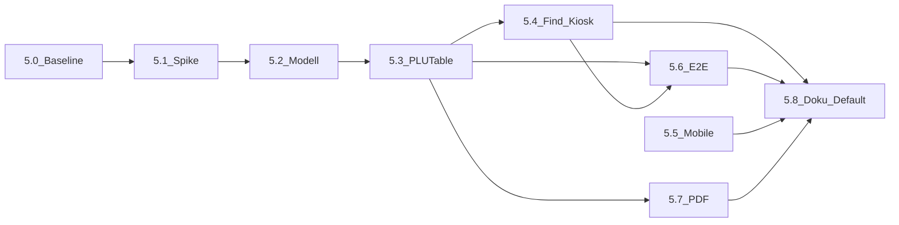

# Stufe 5 – Virtualisierung PLU-Hauptlisten: ausführlicher Agent-/Projektplan

**Voraussetzung:** Stufe 4 für die wichtigsten Seiten ist ausreichend weit (oder ihr akzeptiert Parallel-Risiko). **Messgrundlage:** Profiler / spürbare Lag mit typischer KW-Größe – ohne Messung nicht starten. **Formale Schwelle M0:** [STUFE_5_M0_CHECKLIST.md](STUFE_5_M0_CHECKLIST.md).

**Kurzkonzept & Risiken:** [VIRTUALISIERUNG_SPIKE.md](VIRTUALISIERUNG_SPIKE.md) (weiterhin gültig). Dieses Dokument ist die **operative Zerlegung** in Arbeitspakete **5.0–5.8** plus die **Projektplanung** unten (Meilensteine, Gates, Parallelität).

---

## Projektplanung Stufe 5 (Überblick)

### Meilensteine

| Code | Inhalt | Übergabe-Arbeitspakete | Ergebnis ist erreicht, wenn … |
|------|--------|-------------------------|--------------------------------|
| **M0** | Auftrag & Messung | **5.0** | Zahlen/Screenshot zur Ausgangslage; schriftlich **Go** (inkl. Ctrl+F-Risiko akzeptiert oder Alternative beschlossen). |
| **M1** | Technik-Spike | **5.1** | `@tanstack/react-virtual` eingebunden; Scroll auf Testliste stabil; Build grün. |
| **M2** | Daten-Schicht | **5.2** | VirtualItem-/FlatRow-Zuordnung eindeutig; Unit-Tests zu Indizes/Counts; Kommentar zu `data-row-index`. |
| **M3** | Desktop-Integration | **5.3** | Obst-`PLUTable` mit Flag virtualisiert (ein Modus); keine Layout-Lücken bei fester Zeilenhöhe. |
| **M4** | Navigation & Automatisierung | **5.4**, **5.6** | `scrollToDataRowIndex`(+Scope) + Kiosk; Playwright-Matrix grün für Sprung zur mittleren/letzten Zeile. |
| **M5** | Mobile & Randfälle | **5.5**, **5.7** | Entscheid „Mobile virtualisiert: ja/nein“ dokumentiert; PDF-Stichprobe ok. |
| **M6** | Release | **5.8** | Default/Flag-Finalisierung; ARCHITECTURE + TESTING angepasst; kein Widerspruch zu [.cursor/rules/component-size-and-agents.mdc](../.cursor/rules/component-size-and-agents.mdc). |

### Abhängigkeiten zwischen Paketen



**Parallel erlaubt:** **5.6** (E2E schreiben/ausführen) sobald **5.3** steht – Tests zunächst gegen Flag; härten wenn **5.4** fertig. **5.7** kann früh parallel laufen (reine Datenpfad-Prüfung). **5.5** nach stabilem **5.3** oder zeitlich verschoben, wenn erst nur Desktop ausgeliefert wird.

### Go / No-Go vor Start von Paket 5.1

- [ ] Große repräsentative Liste gemessen (Profiler oder vergleichbare Kennzahl).
- [ ] Feature-Flag-Strategie festgelegt (`VITE_*` oder Prop-only).
- [ ] Branch/PR-Strategie: **kein** Merge zusammen mit großem Stufe‑4-Refactor derselben Listen-Dateien.
- [ ] Produktentscheid zu **Browser-Ctrl+F** (eingeschränkt akzeptiert vs. später eigenes Suchfeld) dokumentiert – siehe [VIRTUALISIERUNG_SPIKE.md](VIRTUALISIERUNG_SPIKE.md).
- [ ] Backshop: Strategie für **Zeilenhöhe** (fest vs. messen) skizziert, sonst nur Obst zuerst virtualisieren.

Bei **No-Go:** bei **M0** stoppen; Konzept in SPIKE/Doku bleibt gültig.

### Offene Entscheidungen (vor/nach M3 festhalten)

| Thema | Optionen | Empfehlung für ersten Release |
|-------|-----------|-------------------------------|
| Rollout | Nur Obst / Obst+Backshop / nur Flag in Beta | Nur **Obst Desktop** + Flag; Backshop nach gleichem Muster in zweiter Welle. |
| Zwei-Spalten | Ein Virtualizer vs. zwei vs. Grid-Zeile | Im Spike **5.3** vergleichen, gewählte Variante in ARCHITECTURE einen Satz. |
| Mobile | Mitvirtualisieren vs. erst Desktop-only | **Desktop-first** dokumentieren; Mobile **5.5** nicht blockieren für ersten Flag-Release. |
| Ctrl+F | Hinweis in UI vs. ignorieren | Kurzer Hilfetext oder interne Doku; siehe SPIKE. |

### Risiken (kurz)

| Risiko | Auswirkung | Mitigation |
|--------|--------------|------------|
| `scrollIntoView` findet keinen Knoten | Suche/Kiosk springt ins Leere | **5.4:** immer `virtualizer.scrollToIndex` vor zweitem Versuch |
| Abweichende Zeilenhöhe Backshop | Sprünge / Zebra falsch | Feste Min-Höhe oder separates Release nur Obst |
| E2E-Flakes durch Smooth-Scroll | Instabile Tests | Playwright `waitForSelector` sichtbar; optional `behavior: 'instant'` nur in Test-Build |
| PDF aus DOM gelesen (Zukunft) | Stille Regression | **5.7:** explizit Hooks/`DisplayItem[]` prüfen |

### Empfohlene Reihenfolge für Agent-Chats

1. Chat A: **5.0** (nur Doku + Messnachweis + Flag-Skeleton ohne Virtualizer).
2. Chat B: **5.1**
3. Chat C: **5.2**
4. Chat D: **5.3** (größter Block – evtl. in zwei PRs: eine Spalte → zwei Spalten).
5. Chat E: **5.4** + erste **5.6**-Tests.
6. Chat F: **5.6** vervollständigen, **5.7**.
7. Chat G: **5.5** (falls in Scope).
8. Chat H: **5.8**

---

## Ziele (messbar)

- Weniger DOM-Knoten bei großen Listen → flüssigeres Scrollen und weniger Layout-Zeit auf schwächerer Hardware (Kiosk).
- **Keine Regression:** „In Liste suchen“, Kiosk-Find-in-Page, PDF-Export (datenbasiert), Mobile-Layout.

---

## Abgrenzung

| In Scope zuerst | Später / separat |
|-----------------|------------------|
| Obst `PLUTable` Desktop-Pfad mit `DisplayItem[]` | Alle anderen langen Listen (Hidden, Campaign-Tabellen, …) |
| Ein Anzeige-Modus (z. B. nur `MIXED` oder nur eine Spaltenlogik) bis stabil | Backshop-Bildzeilen mit dynamischer Höhe ohne Strategie |
| [`scrollToDataRowIndex`](../src/lib/find-in-page-scroll.ts) / [`scrollToDataRowIndexInScope`](../src/lib/find-in-page-scroll.ts) kompatibel halten | Browser-Ctrl+F über alle Zeilen (nur dokumentieren oder eigenes Suchfeld) |

---

## Arbeitspaket 5.0 – Baseline & Freigabe

1. **Messung:** React Profiler oder Performance-Tab: Scroll + Render bei großer Liste (z. B. Test-KW oder anonymisierte Daten). Screenshots/Zahlen kurz in Ticket/PR beschreiben.
2. **Feature-Flag optional:** z. B. `VITE_PLU_VIRTUALIZED=1` oder URL-Query nur in Dev – erleichtert Vergleich und Rollback.
3. **Branch:** eigenes Long-Lived-Branch oder kleine PR-Kette; **nicht** zusammen mit großen Stufe‑4-Page-Refactors mergen.

**Erledigt, wenn:** Produkt/Inhaber „Go“ auf Basis Messung + Risikoakzeptanz (Ctrl+F).

---

## Arbeitspaket 5.1 – Abhängigkeit & Grundgerüst

1. Dependency: `@tanstack/react-virtual` (Version mit React 18 kompatibel – beim Install `npm ls` prüfen).
2. Neue rein technische Hilfsdatei, z. B. `src/lib/plu-table-virtual.ts` oder unter `src/components/plu/` eine `PluTableVirtualViewport.tsx` – **ohne** sofort die ganze `PLUTable` zu ersetzen.
3. Spike: Virtualizer mit **festen** Zeilenhöhen auf einer **Dummy-Liste** (Story oder Dev-only Route optional – nur wenn Projekt das erlaubt; sonst direkt hinter Flag in PLUTable).

**Erledigt, wenn:** `npm run build` grün; Virtualizer scrollt eine Testliste stabil.

---

## Arbeitspaket 5.2 – Datenmodell: eine „VirtualItem“-Liste

1. Aus [`buildFlatRows`](../src/lib/plu-table-rows.ts) (und Typen in [`plu-table-types`](../src/components/plu/plu-table-types.ts)) eine **eindeutige** Abfolge von Einträgen ableiten: Datenzeile vs. Gruppenheader (Buchstabe/Block).
2. Mapping **`logicalRowIndex` ↔ `data-row-index`** dokumentieren (Kommentar im Code). Heute setzt die Tabelle `data-row-index` auf PLU-Zeilen – das muss für Virtualisierung **konstant** bleiben oder absichtlich migriert werden (Breaking für E2E nur mit Anpassung).
3. **Keine zweite Quelle der Wahrheit:** dieselbe FlatRow-Liste wie für nicht-virtualisierte Tabellen, nur andere Render-Schicht.

**Erledigt, wenn:** Unit-Tests für „FlatRows → Anzahl VirtualItems“ oder gleiche Count wie heute.

---

## Arbeitspaket 5.3 – Integration in `PLUTable` (Desktop)

**Datei:** [`src/components/plu/PLUTable.tsx`](../src/components/plu/PLUTable.tsx).

1. Scroll-Parent klären (aktueller overflow-Container der Tabelle).
2. Nur **einen** Codepfad virtualisiert schalten (Flag oder Prop `virtualized`).
3. Rendern: `virtualizer.getVirtualItems()` → nur gemountete Zeilen; `data-row-index` nur auf echte PLU-Zeilen setzen (Header ohne oder mit eigenem Schema – konsistent mit Find-in-Page).
4. **Zwei-Spalten:** entweder zwei Virtualizer oder eine Row mit zwei Zellen – Spike aus VIRTUALISIERUNG_SPIKE umsetzen und Entscheidung festhalten.

**Erledigt, wenn:** Masterliste lädt mit Flag; Scrollen ohne leere „Löcher“ bei fester Höhe.

---

## Arbeitspaket 5.4 – Find-in-Page & Kiosk

1. [`scrollToDataRowIndex`](../src/lib/find-in-page-scroll.ts): wenn kein DOM-Knoten für Index → **`virtualizer.scrollToIndex`** (oder gleichwertig) aufrufen, **danach** kurz warten / `requestAnimationFrame` und optional erneut `scrollIntoView` auf den frisch gemounteten Knoten.
2. [`KioskListFindContext`](../src/contexts/KioskListFindContext.tsx): gleiche Semantik; ggf. Callback von PLUTable nach außen geben (`scrollToLogicalRow`).
3. Seiten mit [`data-find-in-scope`](../src/lib/find-in-page-scroll.ts) (z. B. Backshop Hidden): nicht brechen – Scope-Query bleibt gültig.

**Erledigt, wenn:** Manuelle und Playwright-Tests (siehe 5.6) für mittlere/letzte Zeile grün.

---

## Arbeitspaket 5.5 – Mobile Backshop

**Datei:** [`src/components/plu/PluTableBackshopMobileList.tsx`](../src/components/plu/PluTableBackshopMobileList.tsx).

1. Entscheidung: Mobile **auch** virtualisieren oder nur Desktop (dokumentieren).
2. Wenn ja: gleiche `logicalRow`-Semantik; [`mobile-layout.spec.ts`](../e2e/mobile-layout.spec.ts) erweitern – keine horizontale Überläufe.

---

## Arbeitspaket 5.6 – E2E-Matrix (Pflicht vor Produktions-Default)

Erweiterungen unter `e2e/` (Details [TESTING.md](TESTING.md)):

| ID | Szenario |
|----|----------|
| E5.1 | Obst-Master: Suche springt zu Zeile ~50 und zur letzten Zeile |
| E5.2 | Backshop-Master: gleiches (inkl. Bild-Spalte wenn virtualisiert) |
| E5.3 | Kiosk-Modus: externer Find-Trigger |
| E5.4 | Reload: keine Crashs, korrekte erste Ansicht |
| E5.5 | PDF-Dialog: Item-Zahl unverändert (Staging) |

---

## Arbeitspaket 5.7 – PDF & Export

- Export nur aus **`DisplayItem[]`** / Hooks ([`useMasterListPdfDisplayList`](../src/hooks/useMasterListPdfDisplayList.ts) etc.) – **nicht** aus DOM.
- Regressionstest: Dialog öffnen, Stichprobe Zeilenanzahl.

---

## Arbeitspaket 5.8 – Dokumentation & Default

1. [TESTING.md](TESTING.md): Virtualisierung nicht mehr „nur zurückgestellt“, sondern Abschnitt „aktiviert unter Flag“ / „Default seit …“.
2. [ARCHITECTURE.md](ARCHITECTURE.md): ein Absatz PLUTable + Virtualizer.
3. Flag entfernen oder Default auf `true`, wenn E2E und Feldtests ok.

---

## Prompt-Vorlage für den Agent

```
Arbeite nach docs/REFACTOR_STUFE_5_AGENT_PLAN.md.
Paket: [5.0 / 5.1 / …] – nur dieses Paket, keine großen Nebenrefactors.
Constraint: data-row-index-Semantik und PDF-Datenpfad nicht brechen.
Danach: npm run build && npm run test:run
```

---

## Reihenfolge-Empfehlung (technisch)

`5.0 → 5.1 → 5.2 → 5.3 → 5.4 → 5.6 (parallel zu 5.4 wo möglich) → 5.5 → 5.7 → 5.8`

Bei Blockern zwischen **5.3** und **5.4:** Virtualisierung **nicht** ohne funktionierendes Scroll-zum-Treffer releasen.

**Parallel zur Projektplanung oben:** Meilensteine **M0–M6** und Agent-Chats **A–H** strukturieren dasselbe in management-tauglichen Schritten.
