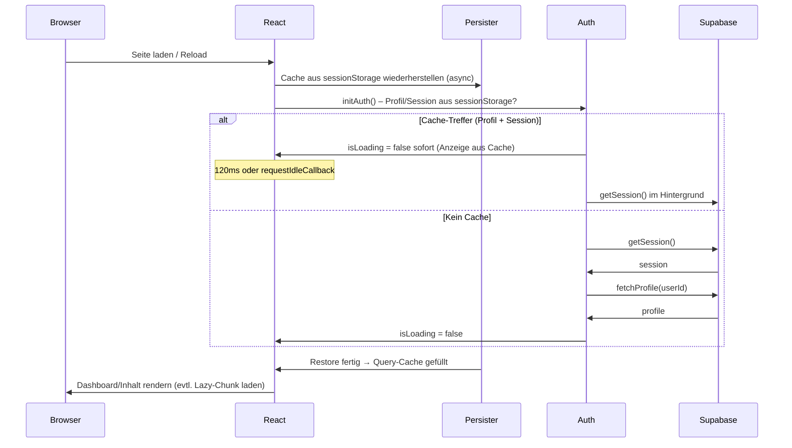

# Reload und Ladeverhalten – Plan für schnelle, flüssige Reloads

## Ziel

Nach Reload (Command-R oder Reload-Button) soll die App **sofort** nutzbar wirken – wie eine normale Webseite. Kein langes Warten auf Spinner; Inhalt (Dashboard, Listen) soll schnell sichtbar sein. Das Verhalten soll **zukunftssicher** sein: neue Features und Datenquellen sollen das gleiche Muster nutzen.

---

## Aktuelle Ladekette (Kurz)

**Was heute passiert:**

1. **Auth:** Wenn beim Reload ein gültiges Profil + Session im `sessionStorage` liegen (`PROFILE_CACHE_KEY`, `SESSION_CACHE_KEY`), setzt der AuthContext sofort `isLoading: false` und zeigt die App mit gecachtem User/Profil. Der echte Session-Check (`getSession`) läuft danach (120ms oder `requestIdleCallback`). **Ohne** Cache: erst `getSession()`, dann `fetchProfile()` → spürbare Verzögerung und Fullscreen-Spinner.

2. **Query-Cache:** Der TanStack-Query-Cache wird über `PersistQueryClientProvider` + `createSyncStoragePersister` in `sessionStorage` persistiert. Die **Wiederherstellung** (`persistQueryClientRestore`) läuft **asynchron** im `useEffect`. Bis sie fertig ist, haben Queries ggf. noch keine Daten → Komponenten zeigen Loading/Skeletons. Danach: Cache gefüllt, UI aktualisiert.

3. **Routen:** Die meisten Seiten sind per `lazy()` geladen. Beim ersten Aufruf einer Route wird der zugehörige JS-Chunk nachgeladen → zusätzliche kurze Verzögerung.

4. **Prefetch:** `AuthPrefetch` startet nach erfolgreicher Auth (inkl. Cache-Pfad) Prefetch für MasterList, Layout, ggf. Admin-Daten. Nützt nur, wenn Auth schnell „fertig“ ist und der Nutzer nicht schon auf eine leere/loading-Seite starrt.

---

## Identifizierte Engpässe

| Engpass | Auswirkung | Priorität |
|--------|------------|-----------|
| **Auth ohne Cache** (z.B. neuer Tab, Cache geleert, Inkonsistenz) | Fullscreen-Spinner bis `getSession` + `fetchProfile` fertig (Netzwerk). | Hoch |
| **Query-Restore dauert** (viel/wenig Inhalt im Cache) | Dashboard/Listen zeigen Loading, bis Restore oder Prefetch fertig. | Hoch |
| **Lazy-Route-Chunk** | Beim ersten Aufruf einer Route kurzer Delay durch Chunk-Load. | Mittel |
| **Kein einheitliches „Shell“-Konzept** | Wenn alles wartet, wirkt die App lange „leer“. | Mittel |
| **Unklare Regeln für neue Features** | Neue Queries/Prefetches werden ad hoc ergänzt → Risiko von Waterfalls oder doppeltem Warten. | Niedrig (Doku) |

---

## Konkrete Maßnahmen (Reihenfolge für Umsetzung)

### 1. Auth-Cache zuverlässig und schnell machen

**Ziel:** Beim Reload fast immer den Cache-Pfad nutzen; wenn nicht, trotzdem schnell reagieren.

- **Cache immer befüllen:** Sicherstellen, dass nach jedem erfolgreichen Login und nach jedem `fetchProfile` der Profil-Cache geschrieben wird (ist bereits so in [AuthContext.tsx](../src/contexts/AuthContext.tsx); prüfen, ob auch nach `runGetSessionAndContinue` bei Cache-Anzeige das Profil erneut in den Cache geschrieben wird, falls es vom Server abweicht).
- **Cache-Gültigkeit:** Keine zusätzliche Ablaufzeit für den Auth-Cache einführen (Session-Ablauf regelt Supabase). Optional: Bei `getSession()`-Fehler oder 401 Cache leeren und zur Login-Seite.
- **Delay bei Cache-Treffer reduzieren oder entfernen:** Derzeit wird `runGetSessionAndContinue` erst nach 120ms oder `requestIdleCallback` ausgeführt. Option: Direkt starten (ohne 120ms), damit die Session schneller aktualisiert wird; oder bei sehr schwacher CPU `requestIdleCallback` mit kleinem Timeout (z. B. 300ms) behalten, damit der First Paint nicht gestört wird. **Empfehlung:** 120ms beibehalten, aber prüfen ob `requestIdleCallback` in allen Ziel-Browsern verfügbar ist; sonst nur `setTimeout(..., 120)`.
- **Kein Blockieren der Anzeige:** Die Anzeige aus dem Cache darf nicht auf das Ende von `getSession` warten (ist bereits so).

**Dateien:** [src/contexts/AuthContext.tsx](../src/contexts/AuthContext.tsx)

---

### 2. Query-Cache-Restore beschleunigen und gezielt einsetzen

**Ziel:** Restore dauert kurz; die sichtbare UI blockiert nicht auf „alles oder nichts“.

- **Persistenz auf wichtige Keys begrenzen (umgesetzt):** Nur ausgewählte Query-Keys werden persistiert. Die **Allowlist** steht in [src/lib/query-persist-allowlist.ts](../src/lib/query-persist-allowlist.ts) (`PERSIST_QUERY_KEY_PREFIXES`). Über `persistOptions.dehydrateOptions.shouldDehydrateQuery` wird nur dehydriert, wenn das erste Element des `queryKey` in dieser Liste steht. So wird weniger gelesen/geschrieben und der Restore ist schneller.  
  **Persistierte Keys (Stand):** Obst: `layout-settings`, `blocks`, `version`, `versions`, `plu-items`, `custom-products`, `hidden-items`, `bezeichnungsregeln`, `all-profiles`. Backshop: `backshop-layout-settings`, `backshop-blocks`, `backshop-version`, `backshop-versions`, `backshop-plu-items`, `backshop-custom-products`, `backshop-hidden-items`, `backshop-bezeichnungsregeln`. Nicht persistiert (dynamisch/voluminös): z. B. `block-rules`, `profiles-hidden-by`, `notification-count`, `version-notification`, `new-products`, `changed-products` und Backshop-Pendants.

- **Fallback:** Wenn kein Custom-Persister gewünscht: Aktuellen Persister beibehalten, aber **throttleTime** prüfen (z. B. 1000ms beim Schreiben). Evtl. auf 500ms reduzieren, damit nach Aktionen schneller persistiert wird; Restore-Seite bleibt unverändert async.

- **UI nicht auf Restore warten lassen:** Die App nutzt aktuell **nicht** `useIsRestoring()`. Das ist gut: Es wird nicht explizit auf Restore gewartet. Stattdessen zeigen die Seiten ihre eigenen Loading-States (Skeleton, Spinner). Wichtig: Diese Loading-States sollten **kurz** sein, sobald Restore und/oder Prefetch laufen. Keine zusätzliche Blockierung auf `isRestoring` einführen, damit die Shell (Header, Navigation) sofort sichtbar bleibt.

**Dateien:** [src/App.tsx](../src/App.tsx) (QueryClient, Persister, dehydrateOptions), [src/lib/query-persist-allowlist.ts](../src/lib/query-persist-allowlist.ts) (Allowlist).

---

### 3. App-Shell sofort anzeigen (kein Fullscreen-Spinner länger als nötig)

**Ziel:** Der Nutzer sieht sofort ein erkennbares Layout (Header, ggf. Platzhalter für Inhalt), nicht nur einen zentralen Spinner.

- **ProtectedRoute / HomeRedirect:** Wenn `isLoading`, aktuell Fullscreen-Spinner. Stattdessen: **App-Shell** anzeigen (gleicher Header wie eingeloggt, Inhalt-Bereich mit Skeleton oder dezentem Spinner), sobald die Route-Komponente bekannt ist. So wirkt die App „da“, auch wenn Auth oder Restore noch laufen.
- **Umsetzung:** Eine minimale **AppShell**-Komponente (Header + Hauptbereich), die immer gerendert wird, sobald wir „innerhalb“ der geschützten App sind. `ProtectedRoute` rendert bei `isLoading` diese Shell + Skeleton statt nur Loader. Dafür muss die Shell keine Auth-Daten für den Header benötigen – oder wir zeigen einen Platzhalter-Header, bis `profile` da ist.
- **Alternative (weniger invasiv):** Nur den Spinner beibehalten, aber sicherstellen, dass `isLoading` nur kurz true ist (siehe Punkt 1: Cache-Pfad stabil). Dann ist Punkt 3 optional.

**Dateien:** [src/components/layout/ProtectedRoute.tsx](../src/components/layout/ProtectedRoute.tsx), [src/components/HomeRedirect.tsx](../src/components/HomeRedirect.tsx), ggf. neue Komponente `AppShell` oder Erweiterung von [DashboardLayout](../src/components/layout/DashboardLayout.tsx).

---

### 4. Lazy-Routen: Chunk für Dashboard vorladen

**Ziel:** Beim Reload die wahrscheinlichste Route (Dashboard) schon laden, damit beim ersten Klick/Redirect kein spürbarer Chunk-Download mehr anfällt.

- Sobald Auth aus Cache bekannt ist (oder sobald `user` + `profile` gesetzt sind), den **Dashboard-Chunk** der aktuellen Rolle vorladen: z. B. `import('./pages/UserDashboard')`, `import('./pages/AdminDashboard')`, `import('./pages/SuperAdminDashboard')` oder die jeweilige Bereichs-Seite. Das kann in `AuthPrefetch` oder in einer kleinen Hilfsfunktion passieren, die nach `isLoading === false` und `user` einmalig `import(...)` aufruft (ohne zu rendern). So ist der Chunk beim ersten Navigieren/Redirect oft schon da.

**Dateien:** [src/components/AuthPrefetch.tsx](../src/components/AuthPrefetch.tsx) oder [src/contexts/AuthContext.tsx](../src/contexts/AuthContext.tsx) (nach setState mit User), [src/App.tsx](../src/App.tsx) (lazy-Definitionen für Referenz).

---

### 5. Prefetch-Strategie bündeln und dokumentieren

**Ziel:** Ein klares, erweiterbares Muster für „welche Daten wann vorladen“, damit neue Features nicht versehentlich das Reload-Verhalten verschlechtern.

- **Zentrale Prefetch-Funktionen** bleiben in [src/hooks/usePrefetchForNavigation.ts](../src/hooks/usePrefetchForNavigation.ts). Dort sind bereits `runMasterListPrefetch` und `runAdminPrefetch` definiert.
- **Regel dokumentieren:**  
  - Beim App-Start: Nur ausführen, wenn User eingeloggt und nicht `mustChangePassword`.  
  - Neue Datenquellen (z. B. neue Liste, neue Admin-Seite): Prefetch in dieselbe Datei aufnehmen und in `AuthPrefetch` oder auf dem zugehörigen Dashboard aufrufen, damit nach Reload die Daten schnell aus Cache oder Prefetch da sind.
- **Keine Wasserfälle:** Prefetch so bauen, dass parallele Requests genutzt werden (wie bereits `Promise.any` für version/versions). Neue Queries, die von anderen abhängen, erst starten, wenn die Abhängigkeit aus dem Cache kommt (wie bei `plu-items` nach version/versions).

**Dateien:** [src/hooks/usePrefetchForNavigation.ts](../src/hooks/usePrefetchForNavigation.ts), [src/components/AuthPrefetch.tsx](../src/components/AuthPrefetch.tsx), diese Doku.

---

### 6. Optional: Kritische Queries sofort aus Cache lesen

**Ziel:** Wenn der Persister den Cache wiederhergestellt hat, sollen Komponenten sofort gecachte Daten anzeigen und im Hintergrund neu fetchen (stale-while-revalidate). Das ist mit TanStack Query Standard, sofern `staleTime` und `gcTime` passen.

- **Prüfen:** `staleTime: 30_000` und `gcTime: CACHE_MAX_AGE_MS` in [App.tsx](../src/App.tsx) sind bereits so gesetzt, dass nach Restore Daten als „vorhanden“ gelten und angezeigt werden. Keine Änderung nötig, außer man führt einen gefilterten Persister ein (dann dieselben Queries dort berücksichtigen).

---

## Empfohlene Reihenfolge der Umsetzung

1. **Auth-Cache stabilisieren** (Punkt 1) – größter Gewinn bei Reload ohne Cache oder bei seltenem Cache-Miss.
2. **Dashboard-Chunk vorladen** (Punkt 4) – wenig Aufwand, spürbar weniger Warten beim ersten Blick aufs Dashboard.
3. **App-Shell bei Loading** (Punkt 3) – bessere Wahrnehmung, auch wenn noch geladen wird.
4. **Query-Persistenz optimieren** (Punkt 2) – optional, wenn Restore in der Praxis noch zu lang ist.
5. **Prefetch-Doku und -Regeln** (Punkt 5) – bei jeder Erweiterung der App berücksichtigen.

---

## Zukunftssicherheit

- **Neue Seiten/Listen:** Prefetch für die zugehörigen Queries in `usePrefetchForNavigation.ts` (oder Backshop-Pendant) aufnehmen und im entsprechenden Dashboard oder in `AuthPrefetch` auslösen.
- **Neue Rollen/Bereiche:** Gleiches Muster: Nach Auth Rolle prüfen, passenden Dashboard-Chunk vorladen, passende Prefetch-Funktion aufrufen.
- **Neue große Datenquellen:** Prüfen, ob sie in die Persistenz sollen (Restore-Zeit) oder nur bei Bedarf geladen werden. Persister-Liste (falls gefiltert) und Prefetch-Liste in dieser Doku kurz halten.

---

## Grundregeln für neue Features

Damit Reloads und Ladezeiten auch bei wachsendem Projekt stabil schnell bleiben:

1. **Auth:** Profil und Session nach jedem erfolgreichen Login und nach jedem `fetchProfile` in den Auth-Cache schreiben (sessionStorage). Cache nur bei Logout oder nachweislich ungültiger Session leeren – nicht bei Netzwerkfehlern.
2. **Neue Daten/Listen:** Prefetch in [src/hooks/usePrefetchForNavigation.ts](src/hooks/usePrefetchForNavigation.ts) (oder Backshop-Pendant) aufnehmen und in `AuthPrefetch` oder auf dem zugehörigen Dashboard auslösen, damit nach Reload Daten schnell aus Cache oder Prefetch da sind.
3. **Neue Routen:** Wenn eine Route direkt nach Login oft angezeigt wird, den zugehörigen Chunk vorladen (gleiches Muster wie Dashboard in [AuthPrefetch](src/components/AuthPrefetch.tsx)).
4. **Kein globales Blockieren:** Kein Warten auf Query-Cache-Restore für die gesamte UI (`useIsRestoring()` nicht als Gate). Shell/Header sofort anzeigen, Inhalte mit Skeleton bis Daten da sind.
5. **Persist-Allowlist:** Neue Queries, die nach Reload sofort verfügbar sein sollen, in [src/lib/query-persist-allowlist.ts](src/lib/query-persist-allowlist.ts) in `PERSIST_QUERY_KEY_PREFIXES` eintragen. Bei neuen Features oder neuen TanStack-Query-Keys prüfen, ob Persistenz nötig ist.

---

## Kurz-Checkliste (nach Umsetzung)

- [ ] Auth: Cache wird zuverlässig geschrieben; bei Reload mit gültigem Cache sofort `isLoading: false`.
- [ ] Optional: 120ms-Delay bei Cache-Treffer getestet/angepasst.
- [ ] Dashboard-Chunk wird nach Auth (Cache oder Netz) vorgeladen.
- [ ] Beim Loading in geschützten Routen: App-Shell + Skeleton statt nur Fullscreen-Spinner (optional).
- [ ] Persister: gefiltert über Allowlist in `src/lib/query-persist-allowlist.ts`; Restore-Zeit im Auge behalten.
- [ ] Prefetch-Regeln und neue Queries in `docs/RELOAD_UND_LAADEVERHALTEN.md` bzw. in `usePrefetchForNavigation` dokumentiert.
- [ ] Persist-Allowlist bei neuen Queries geprüft/ergänzt.
